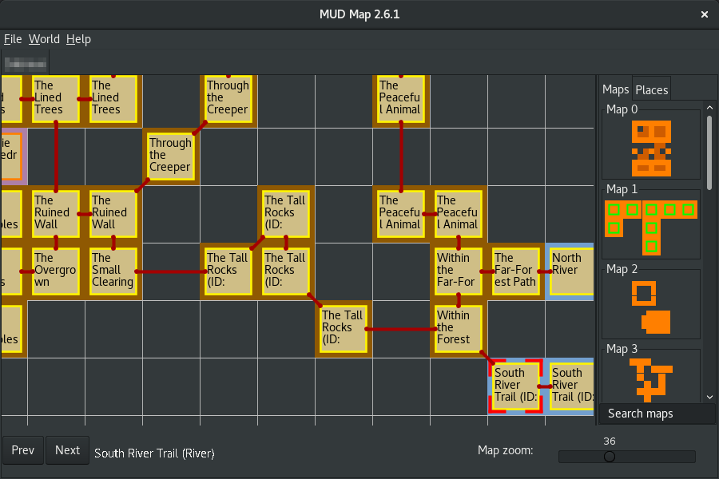

# MUD Map v2
by Neop

A mapping tool for text-based games like text adventures, MUDs and MUSHs.

License: GPLv3
Use it at your own risk!

Consider MUD map unmaintained since I don't have enough time and motivation to work on it. It is usable but I likely won't fix issues (unless they are trivial) or add new features. 



## Requirements:
* a PC with Java JRE 8 or newer (tested with Linux and Windows)

## Links
MUD Map v2 sources, information and binary packages: [https://github.com/Neop/mudmap2](https://github.com/Neop/mudmap2)

## Quick start guide
There is a quick start guide in the help menu explaining the basic features.

## Keyboard shortcuts
You can find a list in the help menu or here: [docs/keyboard_shortcuts.md](docs/keyboard_shortcuts.md)

## Building MUD Map
To build MUD Map from source you will need a Java 7 JDK and Maven. The following command compiles MUD Map and creates a JAR file in the 'target' directory:
```
mvn package
```
Note: The correct JAR file is 'mudmap2-2.x.x-jar-with-dependencies.jar', NOT 'mudmap2-2.x.x.jar'! The following description assumes that the former JAR got renamed to 'mudmap2-2.x.x.jar'.

## Installation
You will need a [Java 8 Runtime Environment (JRE)](https://www.java.com/en/download/manual.jsp) to run MUD Map and the MUD Map JAR file which you can download (see links above) or compile yourself. Place it wherever you like.

## Starting MUD Map
If your operating system is set up to associate JAR file with Java you will be able to start MUD Map with a double click on the JAR file.

Otherwise call the following command on command line or use start_mudmap.sh (Linux). This might also provide more information in case of problems.
```
java -jar mudmap2-2.x.x.jar
```

## Bugs and problems
If you encounter any bugs or other problems please write a [bug report on Github](https://github.com/Neop/mudmap2/issues) or send me an e-mail so I can fix it.

